<h2>hail and well met,</h2>

I use she/her pronouns.
I'm a big fan of Japanese and Taiwanese stationery (hence the letter theme), and I may have moved to Asia partially because of it.
I also enjoy playing TTRPGs (mostly D&D) and listening to/watching D&D actual play shows like <a target="_blank" href="https://www.naddpod.com/">NAADPod</a>, <a target="_blank" href="https://critrole.com/">Critical Role</a>, and <a target="_blank" href="https://www.dropout.tv/dimension-20">Dimension 20</a>, collecting <a target="_blank" href="https://dispeldice.com/">math rocks</a>, sending hand-written letters, cooking vegan food, roller skating, reading fantasy, and surfing the web.
 
 
I started learning to code thanks to Neopets in ~2003, and I began to pour my heart into mediocre pixel art and website layouts drawn in MS Paint and Photoshop. 
I'm so glad I never let my dislike of my art stop me from participating in the pixel communities of that time because I gained so many good memories and learned a lot.
<h2 align="right">- lost</h2>
 
<h2>My Toybox</h2>

<b>disclaimer</b>: where possible, original creators are given credit for their work, but there are a few pixels that I couldn't trace to their original creators. 
I am keen on citing original sources, so I would sincerely appreciate it if you could please reach out via the guestbook if you know one of the orignal artists that I'm missing &lt;3
 

    <a target="_blank" href="https://pixelins.tumblr.com/">
    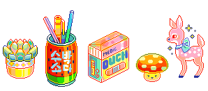
    </a>
    
    
    
    
    
    <a target="_blank" href="http://pokyaron.fc2web.com/sozai.htm">
    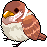
    </a>
    
    
    <a target="_blank" href="https://www.lejlart.com/apple.html">
    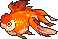
    </a>
    
    <a target="_blank" href="https://www.lejlart.com/apple.html">
    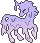
    </a>
    <a target="_blank" href="https://www.lejlart.com/apple.html">
    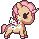
    </a>
    
    
    
    
    
    
    
    
    <a target="_blank" href="https://www.lejlart.com/apple.html">
    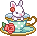
    </a>
    
    
    <a target="_blank" href="http://sorahana.ciao.jp/">
        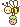
    </a>
    
    
    
    
     
    <a target="_blank" href="https://www.deviantart.com/king-lulu-deer">
        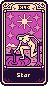 
        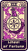 
        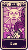 
        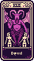
    </a>
     
    
    
    
    
    
    
    

 

    <table bgcolor="#8A2BE2" border=0 width="50%">
        <tr>
            <td>
                

                    <big>you are blueviolet | #8A2BE2</big>
</td></tr><tr><td bgcolor="#FFFFFF">

                    Your dominant hues are blue and magenta. 
                    You're the one who goes to all the parties but doesn't quite fit in at every one... you know what you want, but are afraid of what the world might think of it. 
                    You're a little different and that's okay with them, and if you're smart it's okay with you too.
                     
                     
                    Your saturation level is higher than average - You know what you want, but sometimes know not to tell everyone. 
                    You value accomplishments and know you can get the job done, so don't be afraid to run out and make things happen.
                     
                     
                    Your outlook on life is bright. 
                    You see good things in situations where others may not be able to, and it frustrates you to see them get down on everything.
                    
                

            </td>
        </tr>
        <tr>
            <td>
                

                    <a href="http://spacefem.com/quizzes/colors">spacefem.com html color quiz</a>
                

            </td>
        </tr>
    </table>

