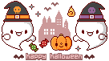

<h2>Updates</h2>
<b>2022.11.01</b> - A little belated, but I went trick-or-treating today on <a target="_blank" href="https://yesterweb.org/trickortreat2022/">Yesterweb's 2022 Trick-or-Treat event</a> and <a href="/halloween2022.html">collected a bunch of treats</a>!
It was so fun and creative! I really want to participate next year and give out tons of cute adoptables.
Since I was in a pixel art mood, I made a strawberry shortcake teacup for adoption on the Afternoon Tea page.
 

<b>2022.10.31</b> - Happy Halloween! Thanks to extremely generous help, this website is now templated with javascript as a workaround for Neocities not allowing PHP, which is what I was used to. 
For the coding-inclined, these were key: <a target="_blank" href="https://www.freecodecamp.org/news/reusable-html-components-how-to-reuse-a-header-and-footer-on-a-website/">1</a>, <a target="_blank" href="https://developer.mozilla.org/en-US/docs/Web/Web_Components/Using_templates_and_slots#adding_flexibility_with_slots">2</a>. 
Somehow I have 5 neocities followers of this site already?
I'm glad I've been able to dedicate enough time over the past three days to get it looking and functionally working the way I imagined.
I created acceptable buttons for site navigation. 
In terms of what to work on next, I want to create the q*bee tribute pixel club and add a few lists in the about me page (likes, dislikes, etc).
 
<b>2022.10.30</b> - I launched the Afternoon Tea pixel club! I really hope people join &lt;3
I also added analytics and a sparkling cursor effect, joined 4 webrings, added an About Me page, linked to more web resources and sites (28 total as of today), and made some site badges. 
I modified the site navigation style, but I'm not satisfied with it, so I'll have to think about that more another day. 
 
<b>2022.10.29</b> - Made pixel link buttons. 
Animating the tamagotchi 32x32 button took a long time, but I think it was worth it. 
 
<b>2022.10.28</b> - I started this site and figured out basic css, responsiveness, and website architecture.
I'm also slowly starting to populate my pixel treasure box.